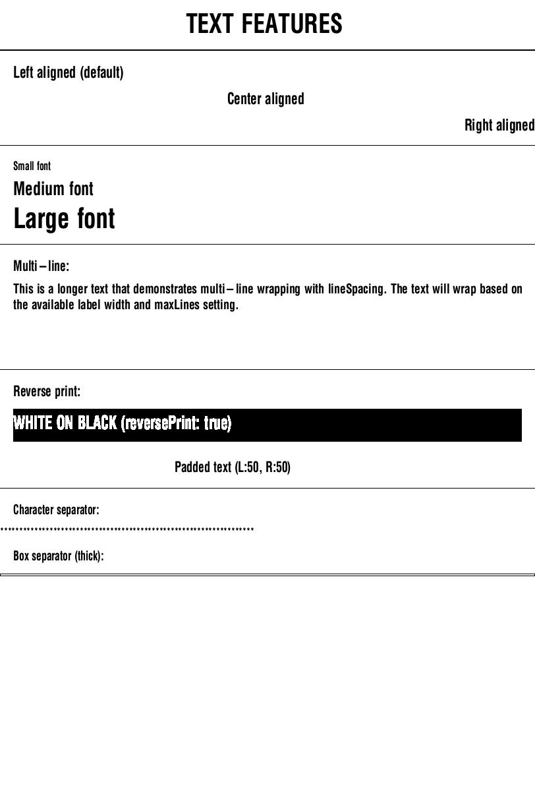
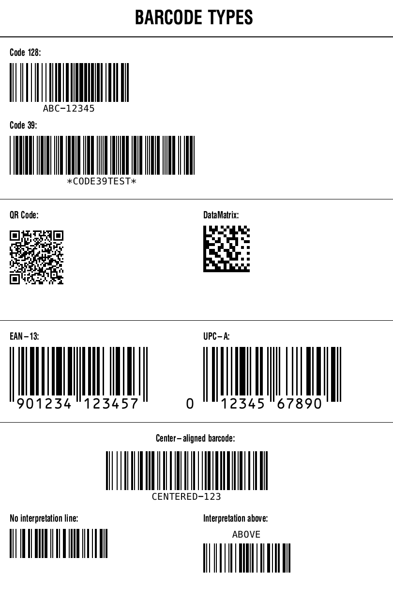
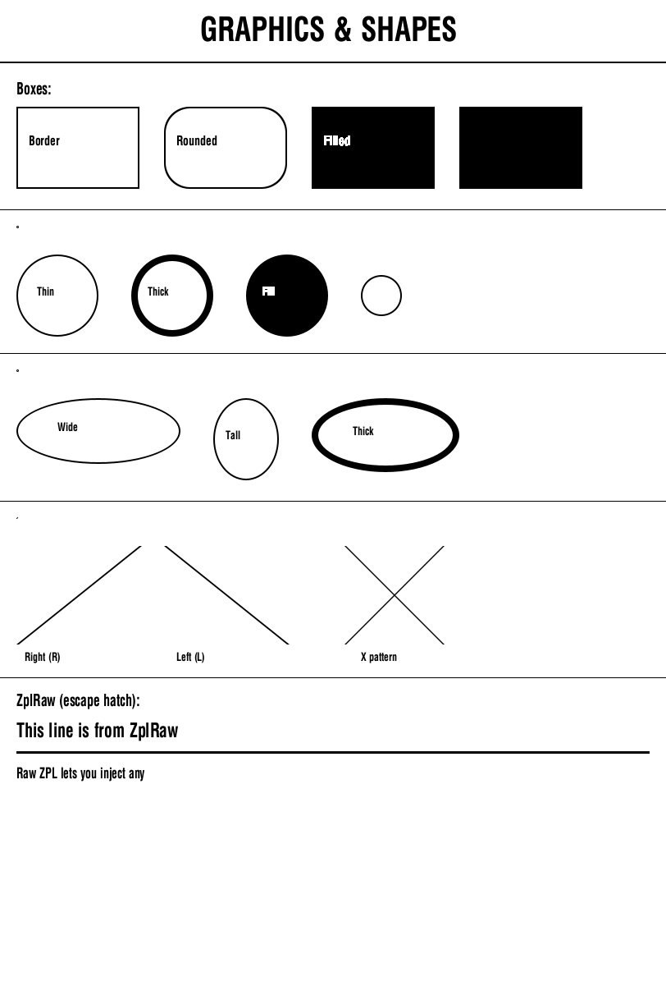
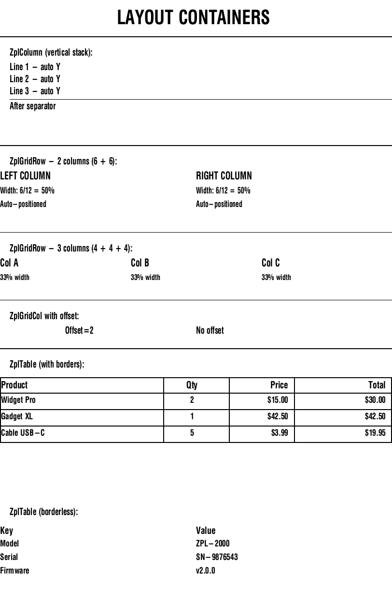
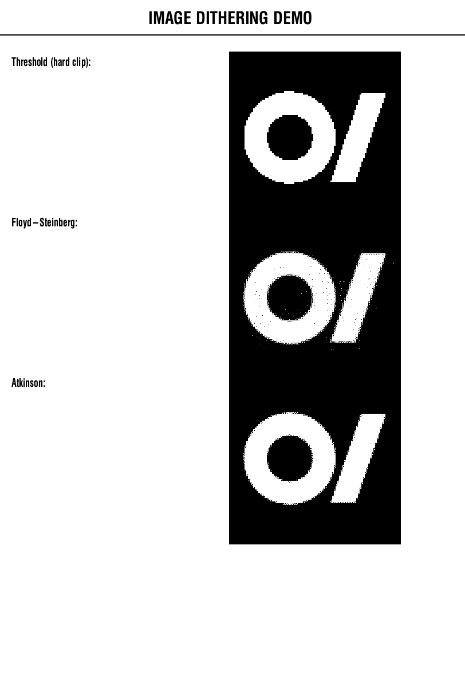
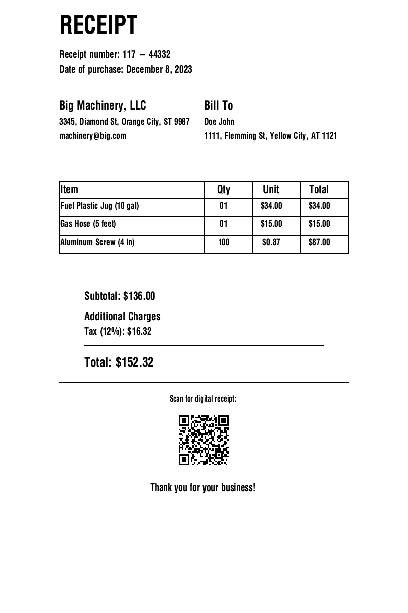

# Flutter ZPL Generator

A comprehensive Flutter package for generating ZPL (Zebra Programming Language) labels with **industry-first TTF font conversion**, **automatic image-to-ZPL conversion** capabilities, and a mathematically robust **12-column grid layout engine**.

[](https://pub.dev/packages/flutter_zpl_generator)
[](https://pub.dev/packages/flutter_zpl_generator/score)
[](https://pub.dev/packages/flutter_zpl_generator/score)

## 📸 Component Demos & Previews

The library boasts an unparalleled set of components, beautifully simulated inside Flutter using the `ZplPreview` widget via the Labelary REST API:

| Text & Fonts | Barcodes & Data Matrix |
| :---: | :---: |
|  |  |
| **Graphics & Shapes** | **Responsive 12-Unit Grid Layout** |
|  |  |
| **Image Dithering Algorithms** | |
|  | |


## 🌟 **What Makes This Package Special**

### 📐 Robust Native Layout Architecture
- **`ZplGridRow` & `ZplGridCol`**: Build complex receipt layouts utilizing a proportional 12-unit grid container with offset spacing capabilities instead of brittle raw `^FO` (Field Origin) numbers.
- **Natural Configuration Flow**: `ZplConfiguration` propagates correctly down to children natively, accurately calculating `ZplAlignment.right` or `ZplAlignment.center` based on `printWidth`.

### 🔤 **TTF to ZPL Font Conversion** (First in Flutter!)
- Convert any TrueType font to ZPL format and upload custom fonts directly to your Zebra printer's memory.
- Use your brand fonts in labels for perfect consistency!
- No more limitations to basic printer fonts.

### 💯 **Unrivaled ZPL Component Coverage**
- Included shapes: `ZplBox`, `ZplGraphicCircle` (^GC), `ZplGraphicEllipse` (^GE), `ZplGraphicDiagonalLine` (^GD).
- **Reverse Print Support (^FR)**: Easily achieve stunning white-on-black UI elements utilizing `reversePrint: true`.
- Native Support for **DataMatrix (^BX)**, EAN-13 (^BE), UPC-A (^BU), Code 128 (^BC), Code 39 (^B3), and QR Codes (^BQ).
- **`ZplRaw` Support**: An escape hatch that lets you cleanly inject highly specific/legacy raw strings (e.g., `^MD` darkness or RFID triggers).


### 🖼️ **Live Flutter Preview**
- The `ZplPreview` widget hooks up directly to Labelary endpoints recursively respecting the `generator` state for immediate real-time feedback visually in Flutter while you code.

---

## 🚀 Quick Start

### Basic Label Generation

```dart
import 'package:flutter_zpl_generator/flutter_zpl_generator.dart';

// Create ZPL commands and pass the configuration natively
final generator = ZplGenerator(
  config: const ZplConfiguration(
    printWidth: 406, // 2 inches at 203 DPI
    labelLength: 203, // 1 inch at 203 DPI
    printDensity: ZplPrintDensity.d8, // 8 dpmm / 203 DPI
  ),
  commands: [
    // Simple text handling
    ZplText(x: 20, y: 20, text: 'Hello World!'),
    
    // Barcode Support
    ZplBarcode(
      x: 20, y: 60, 
      height: 50, 
      data: '12345',
      type: ZplBarcodeType.code128,
      printInterpretationLine: true,
    ),
  ],
);

// Generate ZPL string 
// (Async required if parsing external images or TTF fonts!)
final zplString = await generator.build();
print(zplString);
// Output: ^XA^LL203^PR8^JMB^FO20,20^A0N,,...^XZ
```

---

## 🏗️ Core Layout Components

A massive advantage over writing raw strings is abstracting raw X/Y origins via container-based bounds checks.

### The 12-Unit Grid (`ZplGridRow`)
Create responsive horizontal layouts easily without manually calculating X-offsets.
```dart
ZplGridRow(
  y: 355,
  children: [
    ZplGridCol(
      width: 6, // 50% width bounds
      offset: 0,
      child: ZplText(text: 'LEFT COLUMN', alignment: ZplAlignment.left),
    ),
    ZplGridCol(
      width: 6, // 50% width bounds
      child: ZplText(text: 'RIGHT COLUMN', alignment: ZplAlignment.right),
    ),
  ],
)
```

### Advanced Tabular Data (`ZplTable`)
```dart
ZplTable(
  y: 780,
  columnWidths: [5, 2, 2, 3], // The 12-unit layout
  borderThickness: 2,
  cellPadding: 6,
  headers: [
    ZplTableHeader('Product', alignment: ZplAlignment.left),
    ZplTableHeader('Qty', alignment: ZplAlignment.center),
    ZplTableHeader('Price', alignment: ZplAlignment.right),
  ],
  data: [
    ['Widget Pro', '2', '\$15.00'],
    ['Gadget XL', '1', '\$42.50'],
  ],
)
```

### Graphic Shapes & Escapes
```dart
// Shapes
ZplGraphicCircle(x: 20, y: 310, diameter: 100, borderThickness: 2)
ZplGraphicEllipse(x: 260, y: 485, width: 80, height: 100, borderThickness: 2)

// Diagonal Lines
ZplGraphicDiagonalLine(
  x: 20, y: 665,
  width: 150, height: 120,
  borderThickness: 3, orientation: 'R', // Or 'L'
)

// Inverted Reverse Print (White Text, Black box)
ZplBox(x: 20, y: 620, width: 772, height: 50, borderThickness: 50)
ZplText(
  x: 20, y: 630,
  text: 'WHITE ON BLACK',
  reversePrint: true, // Output ^FR
)

// The Raw Escape Hatch
ZplRaw(command: '^FO20,880^A0N,24,20^FDInject anything directly!^FS')
```

---

## 🧾 Complete Use-Case: Complex Retail Receipt

Combine the 12-Unit Grid, Tables, and Barcodes to generate a fully formatted receipt effortlessly.



```dart
import 'package:flutter_zpl_generator/flutter_zpl_generator.dart';

final generator = ZplGenerator(
  config: const ZplConfiguration(
    printWidth: 576, // 203 DPI standard receipt
    labelLength: 1200,
    printDensity: ZplPrintDensity.d8,
  ),
  commands: [
    // Header
    ZplText(x: 0, y: 30, text: 'RECEIPT', fontHeight: 50, fontWidth: 45),
    ZplText(x: 0, y: 100, text: 'Receipt number: 117 - 44332'),
    ZplText(x: 0, y: 130, text: 'Date of purchase: December 8, 2023'),

    // Company & Bill To (Side-by-side using 12-unit Grid system)
    ZplGridRow(
      y: 200,
      children: [
        ZplGridCol(
          width: 6, // 50% width
          child: ZplColumn(
            children: [
              ZplText(text: 'Big Machinery, LLC', fontHeight: 25, fontWidth: 22),
              ZplText(text: '3345, Diamond St, Orange City, ST 9987', fontHeight: 18, fontWidth: 16),
            ],
          ),
        ),
        ZplGridCol(
          width: 6, // 50% width
          child: ZplColumn(
            children: [
              ZplText(text: 'Bill To', fontHeight: 25, fontWidth: 22),
              ZplText(text: 'Doe John', fontHeight: 18, fontWidth: 16),
            ],
          ),
        ),
      ],
    ),

    // Items table
    ZplTable(
      y: 360,
      columnWidths: [6, 2, 2, 2], // 12-column grid mapping
      borderThickness: 2,
      cellPadding: 6,
      headers: [
        ZplTableHeader('Item', alignment: ZplAlignment.left, fontHeight: 22, fontWidth: 20),
        ZplTableHeader('Qty', alignment: ZplAlignment.center, fontHeight: 22, fontWidth: 20),
        ZplTableHeader('Unit', alignment: ZplAlignment.center, fontHeight: 22, fontWidth: 20),
        ZplTableHeader('Total', alignment: ZplAlignment.center, fontHeight: 22, fontWidth: 20),
      ],
      data: [
        ['Fuel Plastic Jug (10 gal)', '01', '\$34.00', '\$34.00'],
        ['Gas Hose (5 feet)', '01', '\$15.00', '\$15.00'],
        ['Aluminum Screw (4 in)', '100', '\$0.87', '\$87.00'],
      ],
      dataFontHeight: 18,
      dataFontWidth: 16,
    ),

    // Totals
    ZplText(x: 50, y: 580, text: 'Subtotal: \$136.00', fontHeight: 22, fontWidth: 20),
    ZplText(x: 50, y: 650, text: 'Tax (12%): \$16.32', fontHeight: 20, fontWidth: 18),
    ZplSeparator(y: 685, thickness: 2, paddingLeft: 50, paddingRight: 50),
    ZplText(x: 50, y: 710, text: 'Total: \$152.32', fontHeight: 26, fontWidth: 24),

    // Footer with QR code
    ZplSeparator(y: 760, thickness: 1),
    ZplText(x: 0, y: 785, text: 'Scan for digital receipt:', alignment: ZplAlignment.center),
    ZplBarcode(
      x: 0, y: 815,
      data: 'https://receipt.example.com/117-44332',
      type: ZplBarcodeType.qrCode,
      height: 120,
      alignment: ZplAlignment.center,
    ),
  ],
);

final zpl = await generator.build();
print(zpl);
```

---

## 💾 Data Binding & Templating Engine

In logistics and production environments, you shouldn't compile identical labels from scratch 10,000 times. `ZplTemplate` enables you to cache the heavy geometry and image rendering algorithms once, unlocking blistering fast synchronous label generations.

1. **Design the layout** using `{{variable}}` placements in standard commands.
2. **Init the template once** globally.
3. **Bind synchronous data maps** aggressively in a loop.

```dart
// 1. Initial Setup
final template = ZplTemplate(
  ZplGenerator(
    config: const ZplConfiguration(printWidth: 406, labelLength: 203),
    commands: [
      ZplText(x: 10, y: 10, text: 'Hello {{name}}'),
      ZplText(x: 10, y: 50, text: 'Price: \${{price}}'),
      ZplBarcode(x: 10, y: 90, height: 50, data: '{{barcode}}', type: ZplBarcodeType.code128),
    ],
  )
);

// 2. Compile geometry & imagery ONCE 
await template.init();

// 3. Loop generating thousands of labels instantly
for (var dataMap in customers) {
    // Zero layout/AST overhead, pure native string replacement
    final rawZplPayload = template.bindSync(dataMap);
    printer.print(rawZplPayload);
}
```

---

## 🖨️ Production Print Configurations (`^PQ`)

**Purpose**: In production environments, you often need to print multiple copies of the exact same label without transmitting the entire payload over Wi-Fi/Bluetooth multiple times. `ZplPrintQuantity` safely delegates the responsibility of duplicating the label directly to the printer's internal memory buffer.

**Placement Guidelines**: You can append `ZplPrintQuantity` anywhere inside the `commands:` list. It will safely execute hardware features natively before the label officially terminates (`^XZ`).

```dart
final generator = ZplGenerator(
  config: const ZplConfiguration(printWidth: 406, labelLength: 203),
  commands: [
    ZplText(x: 10, y: 10, text: 'Product Label'),
    
    // You can place this command anywhere in the 'commands' array!
    // This offloads the work to the printer hardware itself:
    // "Print 50 copies of this label, and physically pause after every 10."
    ZplPrintQuantity(quantity: 50, pauseInterval: 10),
  ],
);
```

## 🔢 Auto-Increment Serialization (`^SN`)

When printing many identical layout labels but with increasing/decreasing ID numbers (e.g. SN-001, SN-002, SN-003), sending a new payload for every single label is highly inefficient. 

Instead, you can combine `ZplPrintQuantity` with a `ZplText` configured for **hardware serialization**. The printer will calculate and index the variable numbers internally!

```dart
final generator = ZplGenerator(
  config: const ZplConfiguration(printWidth: 406, labelLength: 203),
  commands: [
    // This looks like static text, but we attach a 'serialization' config to it
    ZplText(
      x: 10, 
      y: 10, 
      text: 'SN-001', // Your starting value
      serialization: const ZplSerialConfig(
        increment: 1,      // +1 per label copy 
        leadingZeros: true // Keep it exactly 3 digits long ('001' -> '002' -> '003')
      ),
    ),
    
    // We only send 1 print job over Wi-Fi, but the printer hardware will 
    // eject 10 labels counting up to 'SN-010' automatically!
    ZplPrintQuantity(quantity: 10),
  ],
);
```

---

## 📡 Enterprise RFID Tag Encoding (`^RF` / `^RS`)

Generate "Smart Labels" by leveraging Zebra's dual-hardware printers (like the *ZT411 RFID*). You can encode the tiny silicon microchip hidden inside the label **at the exact same time** you print the visual ink barcodes! 

```dart
final generator = ZplGenerator(
  config: ZplConfiguration(printWidth: 406, labelLength: 203),
  commands: [
    // 1. Tell the printer what hardware protocol to run (EPC Class 1 Gen 2)
    ZplRfidSetup(tagType: 8),

    // 2. Blast your payload onto the actual RFID Antenna using HEX!
    // (This encodes 11112222 directly into the EPC bank block 3)
    ZplRfidWrite(
      data: '11112222',
      operation: RfidOperation.write,
      format: RfidDataFormat.hex,
      startingBlock: 3, 
      byteCount: 4,
      memoryBank: RfidMemoryBank.epc,
    ),

    // 3. Normal printing logic is executed in parallel!
    ZplText(x: 10, y: 10, text: 'This text gets printed with ink!'),
    ZplBarcode(x: 10, y: 50, data: '11112222', type: ZplBarcodeType.code128),
  ],
);
```
> Note: When using `RfidDataFormat.hex`, the library strictly asserts that your payload only contains completely valid `[0-9A-Fa-f]` characters to prevent silent printer-locking failures.

---

## 🌟 TTF Font & Image Conversion

### Import Custom Fonts to Your Printer

Convert TrueType fonts (TTF) to ZPL format and upload them directly to your Zebra printer's RAM.

#### Step 1: Convert TTF Font to ZPL

```dart
import 'dart:io';
import 'package:flutter_zpl_generator/flutter_zpl_generator.dart';

// Load your TTF font file
final fontFile = File('assets/fonts/Roboto-Regular.ttf');
final fontBytes = await fontFile.readAsBytes();

// Convert TTF to ZPL format
final zplFontData = await LabelaryService.convertFontToZpl(
  fontBytes,
  'Roboto-Regular.ttf',
  name: 'R', // Single letter alias for the font
);
// Sends output to printer memory: ~DU...
```

#### Step 2: Use the Font Asset in Your Labels

```dart
final generator = ZplGenerator(
  config: ZplConfiguration(printWidth: 406, labelLength: 609),
  commands: [
    ZplFontAsset(
      alias: 'R',
      fileName: 'ROBOTO.TTF',
      fontData: fontBytes,
    ),
    const ZplText(
      x: 50, y: 100,
      text: 'Custom Font Text!',
      fontAlias: 'R', // Use your custom font
      fontHeight: 25,
    ),
  ]
);

final zplNetworkString = await generator.build();
```

### Convert Images to ZPL Graphics

Transform any image (PNG, JPEG, GIF) into ZPL graphics that can be embedded directly in your labels:

```dart
// Convert to ZPL graphics
final zplGraphics = await LabelaryService.convertImageToGraphic(
  imageBytes,
  'logo.png',
  outputFormat: LabelaryGraphicOutputFormat.zpl,
  blackThreshold: 128 // Auto-Dithering
);
```

### Advanced Image Dithering (Pristine Graphics)
`ZplImage` now supports advanced image dithering natively in Dart. This converts continuous-tone photographs and colorful gradients into meticulously balanced dot patterns that print beautifully on 203 DPI devices.

```dart
// 1. Floyd-Steinberg (Default) - Smoothly disperses dots for natural gradients
ZplImage(
  x: 20, y: 20,
  image: bytes,
  ditheringAlgorithm: ZplDitheringAlgorithm.floydSteinberg,
)

// 2. Atkinson - High contrast dot pattern without washing out (vintage print look)
ZplImage(
  x: 20, y: 150,
  image: bytes,
  ditheringAlgorithm: ZplDitheringAlgorithm.atkinson,
)

// 3. Threshold - Hard black & white clipping (Legacy behavior)
ZplImage(
  x: 20, y: 280,
  image: bytes,
  ditheringAlgorithm: ZplDitheringAlgorithm.threshold,
)
```

### ACS Image Compression (^GFA)
ZPL payloads containing high-resolution images can grow massive, taking several seconds to transmit to the printer over Bluetooth or Serial connections. 

You can compress the payload using `ZplImageCompression.acs`, which mathematically encodes the byte layout (Run-length Encoding). This routinely shrinks image payloads by **60-90%**, slashing transmission delays!

```dart
ZplImage(
  x: 20, y: 20,
  image: highResPhotoBytes,
  compression: ZplImageCompression.acs, // Emits ^GFA instead of ~DG
)
```

---

## 👁️ Conditional Printing (`ZplConditional`)

Sometimes you want to show or hide entire layout sections natively based on condition flags (e.g. `hasDiscount`, `showSerialNumber`).

Instead of writing messy ternary operators inside Dart lists `if (true) myObj,`, we've introduced `ZplConditional` mapping. If `condition: false`, it safely outputs an empty string, and gracefully returns `0` layout height so surrounding containers like `ZplColumn` immediately collapse the missing element without rendering any blank gaps!

```dart
final generator = ZplGenerator(
  commands: [
    ZplText(text: 'Product: Widget'),
    ZplConditional(
      condition: product.hasDiscount, // If false, the below command is skipped AND collapses safely in columns
      child: ZplText(text: 'SALE: \${product.discount}% OFF', reversePrint: true),
    ),
    ZplBarcode(data: product.sku, type: ZplBarcodeType.code128),
  ],
)
```

---

## 📱 Live Preview Details (Labelary Integration)

You can preview the receipt in pseudo-real-time simply by wrapping your `generator` reference mathematically natively.

```dart
class LabelPreviewScreen extends StatelessWidget {
  
  final generator = ZplGenerator(
      config: const ZplConfiguration(printWidth: 406, labelLength: 203),
      commands: [ ... ]
  );

  @override
  Widget build(BuildContext context) {
    return ZplPreview(
      generator: generator, // Hot-reloads on Widget Rebuild automatically!
    );
  }
}
```

If you prefer to hit the REST API directly for PDFs or native assets:
```dart
final response = await LabelaryService.renderFromGenerator(
  generator,
  outputFormat: LabelaryOutputFormat.pdf,
);

// Write bytes to disk
await File('label.pdf').writeAsBytes(response.data);
```

## Related Projects
- [Labelary API](https://labelary.com/) - Online ZPL viewer and API
- [ZPL Programming Guide](https://www.zebra.com/us/en/support-downloads/knowledge-articles/ait/zpl-programming-guide.html)
- [Zebra Printers](https://www.zebra.com/us/en/products/printers.html)