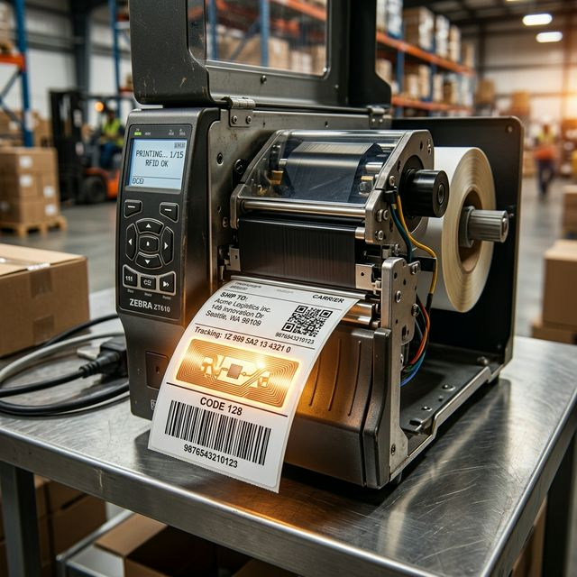

# Mastering RFID Smart Labels with flutter_zpl_generator



If you have ever worked in logistics, warehousing, or retail, you know the limitations of traditional barcodes. They require a direct line of sight. They must be scanned one by one. They are prone to smudging and tearing.

Radio-Frequency Identification (RFID) solves these problems entirely. With RFID, a single scanner can read hundreds of items simultaneously, straight through cardboard boxes and across fast-moving conveyor belts—no visual contact necessary. 

Modern Zebra printers, such as the ZT411 RFID, are incredible machines because they are dual-purpose. They print the visual information (like text and barcodes) using a thermal print head while simultaneously using a built-in radio antenna to encode data onto the tiny silicon microchip embedded inside the label. We call these "smart labels."

Starting with version 1.2.0, the `flutter_zpl_generator` package brings native support for this powerful print-and-encode workflow to Flutter. In this guide, we will explore the fundamentals of RFID encoding in ZPL and how you can implement it in your applications.

---

## The Mechanics of Print-and-Encode

An RFID label consists of a standard adhesive label with a microscopic chip and an antenna (an "inlay") hidden inside. When you send a print job to a Zebra RFID printer, two things happen at once:

1.  **Visual Printing**: The thermal print head burns the traditional ZPL commands (text, shapes, barcodes) onto the label surface.
2.  **Radio Encoding**: The printer's internal antenna sends a signal to power the inlay's microchip and burn data into its memory.

In the Zebra Programming Language (ZPL), this radio encoding is controlled by two specific commands: `^RS` (RFID Setup) and `^RF` (RFID Read/Write Format).

---

## Demystifying RFID Memory Banks

Before writing data, it is crucial to understand where that data goes. The industry standard EPC Class 1 Gen 2 RFID tag contains four distinct memory banks:

1.  **Bank 0 (Reserved)**: Used for storing the kill and access passwords.
2.  **Bank 1 (EPC)**: The Electronic Product Code. This is the primary identifier that scanners read as items move through a supply chain.
3.  **Bank 2 (TID)**: The Tag ID. This is a unique, permanently factory-burned identifier that cannot be changed.
4.  **Bank 3 (User)**: Optional memory for custom application data (like manufacture dates or batch codes).

For the vast majority of use cases, you will be interacting exclusively with the **EPC** bank.

---

## Step-by-Step Implementation in Flutter

The `flutter_zpl_generator` package abstracts the complexity of raw ZPL strings into strongly typed Dart objects. Here is how you can build an RFID-enabled label.

### 1. Hardware Initialization (`ZplRfidSetup`)

Before reading or writing data, you must configure the printer for the specific type of RFID tags loaded in its tray. This is equivalent to the `^RS` command.

```dart
import 'package:flutter_zpl_generator/flutter_zpl_generator.dart';

// Initialize the printer for standard EPC Class 1 Gen 2 tags
ZplRfidSetup(tagType: 8)
```

You can also specify advanced recovery actions. For instance, if the printer detects a defective chip, you can tell it to print a void pattern and try the next label automatically:

```dart
ZplRfidSetup(
  tagType: 8,
  voidPrintLength: 50, // Print a 50-dot void pattern on failure
  labelsPerForm: 2,    // Attempt to print up to 2 labels before erroring
)
```

### 2. Encoding the Payload (`ZplRfidWrite`)

To transfer data onto the chip, use the `ZplRfidWrite` class. This maps to the `^RF` command and supports all standard operations, from writing data to locking memory banks.

```dart
ZplRfidWrite(
  data: '3034257BF461AD20',        // Hexadecimal payload
  operation: RfidOperation.write,  // W
  format: RfidDataFormat.hex,      // H
  startingBlock: 0,
  byteCount: 8,                    // 8 bytes (16 hex characters)
  memoryBank: RfidMemoryBank.epc,  // 1
)
```

### 3. Assembling the Complete Smart Label

Let us combine the visual and radio commands into a single `ZplGenerator` pipeline. This will print a traditional shipping label and simultaneously encode its digital twin into the EPC bank.

```dart
final generator = ZplGenerator(
  config: const ZplConfiguration(
    printWidth: 812, 
    labelLength: 609,
    printDensity: ZplPrintDensity.d8,
  ),
  commands: [
    // Step 1: Initialize RFID Hardware
    ZplRfidSetup(tagType: 8),

    // Step 2: Encode the EPC Bank
    ZplRfidWrite(
      data: 'DEADBEEF01020304',
      operation: RfidOperation.write,
      format: RfidDataFormat.hex,
      startingBlock: 0,
      byteCount: 8,
      memoryBank: RfidMemoryBank.epc,
    ),

    // Step 3: Print the visual components
    ZplText(
      x: 20, y: 20,
      text: 'WAREHOUSE SMART LABEL',
      fontHeight: 40,
      fontWidth: 35,
    ),
    ZplBarcode(
      x: 20, y: 100,
      data: 'DEADBEEF01020304',
      type: ZplBarcodeType.code128,
      height: 80,
      printInterpretationLine: true,
    ),
  ],
);

final zplString = await generator.build();
// You can now send zplString to your printer via flutter_zpl_printer!
```

---

## Native Safety: Hexadecimal Validation

The most common point of failure in RFID workflows is providing malformed data to the printer. If you send a non-hexadecimal string to a printer expecting hex data, the printer will silently ignore the command, resulting in unencoded, "dead" tags entering your supply chain.

To prevent this, `flutter_zpl_generator` includes rigorous runtime validation. If you attempt to pass invalid characters while using `RfidDataFormat.hex`, the package throws a descriptive `ArgumentError` immediately locally, before the ZPL is even generated:

```dart
// This code will throw an error and fail fast
ZplRfidWrite(
  data: 'NOT_A_HEX_STRING',
  format: RfidDataFormat.hex,
).toZpl(config);

// Error: ZplRfidWrite: hex format requires valid hex characters (0-9, A-F) only, got "NOT_A_HEX_STRING"
```

---

## High-Performance Production with Templates

If you are generating thousands of unique shipping labels, recalculating geometries and image dithering algorithms for every single label is highly inefficient. 

For high-volume operations, you should pair `ZplRfidWrite` with the new `ZplTemplate` engine. This allows you to compile the expensive parts of the label once, and synchronously inject dynamic EPC codes in a tight loop.

```dart
// 1. Define the layout with {{placeholders}}
final template = ZplTemplate(
  ZplGenerator(
    config: const ZplConfiguration(printWidth: 812, labelLength: 609),
    commands: [
      ZplRfidSetup(tagType: 8),
      ZplRfidWrite(
        data: '{{dynamic_epc}}',
        format: RfidDataFormat.hex,
        startingBlock: 0,
        byteCount: 8,
        memoryBank: RfidMemoryBank.epc,
      ),
      ZplText(x: 20, y: 20, text: 'Product: {{product_name}}'),
      ZplBarcode(x: 20, y: 100, data: '{{dynamic_epc}}', type: ZplBarcodeType.code128),
    ],
  ),
);

// 2. Perform the heavy AST initialization once
await template.init();

// 3. Blast dynamic data at sub-millisecond speeds
final databaseRecords = [
  {'name': 'Widget Alpha', 'epc': 'AABB11220000FF01'},
  {'name': 'Widget Beta',  'epc': 'AABB11220000FF02'},
];

for (final record in databaseRecords) {
  final fastZpl = template.bindSync({
    'product_name': record['name']!,
    'dynamic_epc': record['epc']!,
  });
  
  printer.print(fastZpl);
}
```

---

## Developer Best Practices

As you integrate RFID into your logistics architecture, keep these considerations in mind:

*   **Default Tag Type**: EPC Class 1 Gen 2 (`tagType: 8`) is the ubiquitous standard. Unless you have highly specialized legacy tags, this should always be your default.
*   **Exact Byte Counting**: When supplying hexadecimal strings, ensure the string length perfectly aligns with your expected byte count. Each byte requires exactly two hex characters (e.g., 8 bytes = 16 characters).
*   **Data Immutability**: If you need to ensure a tag is permanently tamper-proof once it leaves your facility, use `RfidOperation.writeWithLock`. Be warned: this action is irreversible. You will not be able to rewrite the chip later.
*   **Emulators vs. Hardware**: Remember that the Labelary API cannot simulate RFID encoding. The `^RS` and `^RF` commands execute entirely at the RF-antenna hardware level. While `flutter_zpl_generator` ensures your syntax is flawlessly formatted, real-world testing must be conducted on physical Zebra devices (like the ZT411 series).

---

## Conclusion

Radio-Frequency Identification is transforming inventory management from a line-of-sight challenge into a seamless, automated breeze. By combining the `flutter_zpl_generator` package's new RFID commands with its robust templating engine, you can deploy enterprise-grade, high-volume smart label printing workflows directly from your Dart and Flutter applications.
