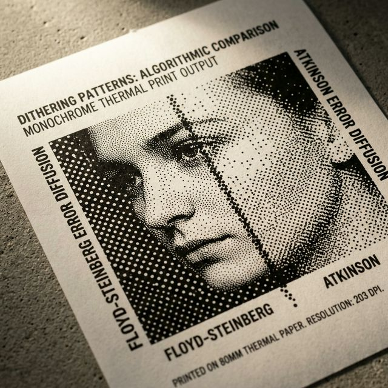

# Perfecting Monochrome Prints: A Dive into ZPL Image Dithering



Thermal barcode printers are incredible machines for printing sharp text and crisp barcodes. However, they possess one major limitation: they can only print pure black dots or leave the paper blank. There are no shades of gray.

When you attempt to print a standard color photograph or a graphic with smooth gradients on a Zebra printer, the software must decide whether each pixel should be 100% black or 100% white. Historically, this conversion resulted in highly washed-out images with hard, jagged edges.

Starting with `flutter_zpl_generator` v1.2.0, the `ZplImage` widget introduces native, high-performance **Dithering Algorithms** written entirely in Dart. This completely transforms how your images look on standard 203 DPI thermal printers.

---

## 📸 The Visual Difference

Here are the three algorithms in action side-by-side. 


By intelligently distributing the "error" of converting a pixel to black or white to its neighboring pixels, dithering creates the optical illusion of grayscale tones using only pure black dots.

---

## The Algorithms Explained

The `ZplDitheringAlgorithm` enum gives you three distinct modes to convert continuous-tone images into monochrome hexadecimal maps perfectly suited for the `~DG` (Download Graphics) ZPL command.

### 1. Floyd-Steinberg (The New Default)
This is the gold standard for natural image reproduction. Floyd-Steinberg smoothly diffuses quantization errors across adjacent pixels. 

**Best for**: Photographs, smooth gradients, and natural lighting.
**Result**: Extremely smooth optical illusions of gray tones.

```dart
ZplImage(
  x: 20, y: 20,
  image: avatarBytes,
  ditheringAlgorithm: ZplDitheringAlgorithm.floydSteinberg,
)
```

### 2. Atkinson Dithering
Developed by Bill Atkinson for the original Apple Macintosh, this algorithm diffuses only a fraction (3/4) of the quantization error. This prevents dots from clustering too heavily.

**Best for**: Vintage graphics, high-contrast imagery, and detailed line art on lower resolution (203 DPI) printers.
**Result**: A distinct, high-contrast "newspaper print" dot pattern without the image completely washing out into darkness.

```dart
ZplImage(
  x: 20, y: 150,
  image: vintageArtBytes,
  ditheringAlgorithm: ZplDitheringAlgorithm.atkinson,
)
```

### 3. Threshold (Legacy Mode)
This is the simplest approach. If a pixel's luminance is over 50%, it becomes white; otherwise, it becomes black. No error diffusion is calculated.

**Best for**: Pure black-and-white logos, icons, and vector-style graphics that should not have half-tone patterns.
**Result**: Complete, solid, hard separations between black and white.

```dart
ZplImage(
  x: 20, y: 280,
  image: companyLogoBytes,
  ditheringAlgorithm: ZplDitheringAlgorithm.threshold,
)
```

---

## Performance Considerations

Running image processing mathematically natively inside Dart allows Flutter apps to bypass bloated dependencies and offline backend converters. 

Our dithering algorithms are heavily optimized using raw `Float32List` memory allocations and contiguous array looping, ensuring that converting even large graphical elements will generate the ZPL Hex map string in mere milliseconds securely and completely offline on the user's device.

## Conclusion

With `ZplImage` transitioning from naive thresholding to mathematically sound error-dispersion dithering, your receipts, shipping labels, and ID badges can finally feature beautiful, recognizable graphics printed entirely on standard thermal hardware.

Happy printing!
